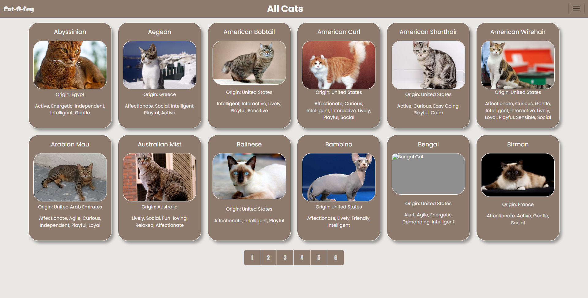
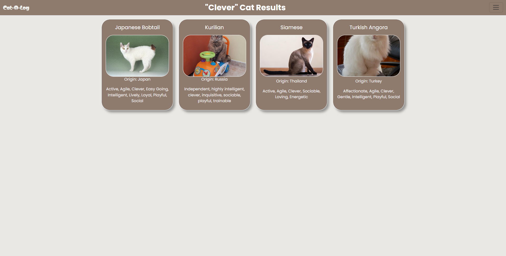
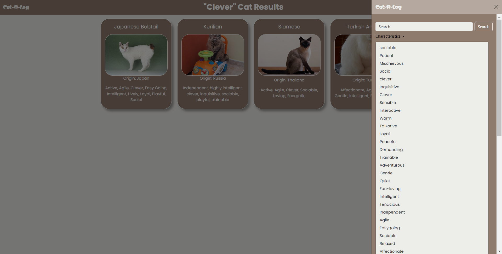
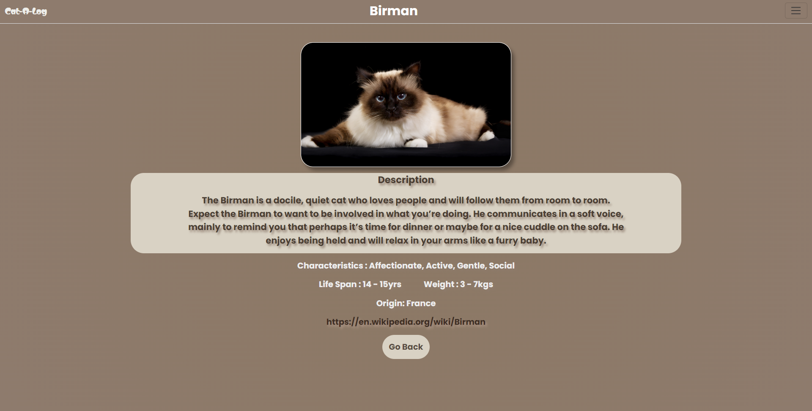

# Cat-a-Log

## Overview

**Cat-a-Log** is a user-friendly web application built with **Flask** that allows cat lovers to explore a variety of cat breeds, their traits, and detailed descriptions. The app pulls data from an external API to provide in-depth information about each breed, including unique characteristics, behaviors, and more. The application features an intuitive, responsive design, making it easy for users to navigate across devices.

 

## Key Features

- **Explore Cat Breeds**  
  Browse through a diverse collection of cat breeds, each with detailed traits, descriptions, and images. Learn about the unique characteristics of various cat breeds.

- **Search by Traits/Keywords**  
  Easily search for breeds based on specific traits such as "playful", "affectionate", or "independent". The search functionality lets you find cats based on characteristics that match your preferences.

   
   

- **Pagination Support**  
  Navigate through multiple pages of cat breed listings with convenient pagination controls, making it easy to explore a large set of data.

- **Detailed View**  
  Get a closer look at any breed by clicking on its name. View its name, description, traits, and more in an organized layout.

   

- **Responsive Design**  
  The app is styled using SCSS for a clean, modern look that adapts seamlessly to mobile, tablet, and desktop screens.

## Usage

- **Home Page**  
  The homepage displays the first page of available breeds, complete with pagination controls to navigate through additional pages of breeds.

- **Search**  
  Use the search bar to search for breeds by specific traits or keywords. Simply enter a trait (e.g., "playful") to see the relevant breeds.

- **Pagination**  
  Navigate through the breed listings by clicking the page number buttons. Each page displays a set of cat breeds, and you can go back or forward to explore more.

- **Breed Details**  
  Clicking on any breed’s name will take you to a dedicated page that provides detailed information about that breed, including its traits, description, and more.

## Project Structure

The project is organized for clarity and modularity, using **Flask** for backend functionality and **SCSS** for styling:

- **`app.py`**  
  Contains the Flask routes, data-fetching logic, and error handling. The routes define core functionalities like browsing, searching, and viewing breed details.

- **`templates/`**  
  Contains HTML templates that are dynamically rendered with breed data and search results using Jinja2.

- **`static/`**  
  Includes SCSS files and other static resources like images, CSS, and JavaScript.

## Core Technologies

- **Flask**: Web framework used to handle routing, requests, and template rendering.
- **Flask-SCSS**: Adds support for SCSS stylesheets to create a responsive and clean design.
- **Requests**: Handles API requests to fetch breed data from an external API.
- **External API**: Fetches breed data from `https://api.freeapi.app/api/v1/public/cats`.

## Languages Used

- **Python**: Backend logic and API integration with Flask.
- **HTML**: Web page structure using Jinja2 for template rendering.
- **CSS/SCSS**: Styling the user interface and making it responsive.
- **JavaScript**: Used for adding interactive elements and animations.


## Key Code Highlights

- **Data Fetching (`fetch_cats`)**  
  Retrieves cat breed data from the external API and handles any potential issues with the response format.

- **Pagination (`calculate_total_pages`)**  
  Calculates the total number of pages based on the total number of breeds and the limit of items per page.

- **Search Route (`/search=<string:word>`)**  
  Allows users to search for specific breeds by traits or keywords. This functionality processes the search query and fetches matching breeds.

- **Error Handling**  
  Custom error pages are implemented for 404 errors, ensuring users have a smooth experience even if they navigate to a non-existent page.

## Installation

To set up this project locally, follow these steps:

### 1. Clone the repository
```bash
git clone https://github.com/yourusername/cat-a-log.git
cd cat-a-log
```


### 2. Set up a virtual environment (optional but recommended) 


```bash
python3 -m venv venv
source venv/bin/activate  # On Windows: venv\Scripts\activate
```


### 3. Install dependencies 


```bash
pip install -r requirements.txt
```


### 4. Run the Flask app 


```bash
python app.py
```

Visit `http://127.0.0.1:5000/` in your browser to see the app in action.

## License 

This project is licensed under the MIT License - see the [LICENSE](LICENSE)  file for details.